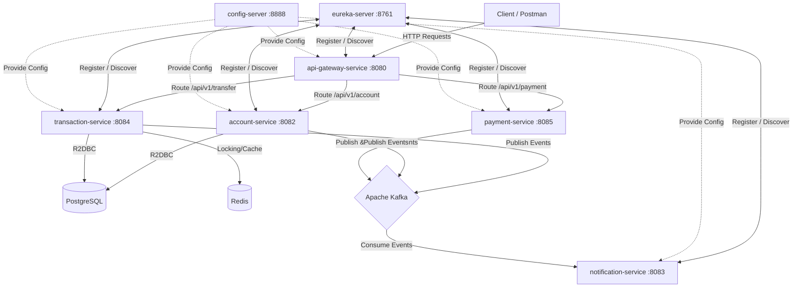

# 🛡️ Real-Time Fraud Detection & Banking Microservices App

**Author:** Anish Raj

A high-performance, reactive, event-driven banking microservices application built using **Spring Boot**, **Spring Cloud**, **Project Reactor**, and **Apache Kafka**. This project provides secure digital banking capabilities, including real-time transaction processing, account management, fraud detection, and instant notifications.

---

## 🏗️ System Architecture

The architecture consists of decentralized, reactive microservices communicating asynchronously via Apache Kafka and coordinated under a Eureka service registry.



---

## 🧠 Architectural Design Rationale

To meet the high-throughput, low-latency, and fault-tolerant requirements of modern financial applications, the system implements three core architectural patterns:

### 1. Why Reactive Approach? (Spring WebFlux & Project Reactor)
*   **Non-Blocking I/O**: Unlike traditional servlet-based architectures (which bind one thread per client request), the reactive model uses an event-loop system to process requests asynchronously. Threads are never blocked waiting for slow operations like database queries or network calls.
*   **Resource Efficiency**: It achieves extremely high scalability and throughput with a minimal footprint of CPU and memory, ensuring optimal resource utilization under high traffic.
*   **Backpressure Handling**: Integrates end-to-end backpressure support, preventing consumer services from being overwhelmed by spikes in fast-producing upstream data streams.

### 2. Why Apache Kafka?
*   **Decoupled Event-Driven Messaging**: Kafka acts as a central neural network, allowing microservices to publish and subscribe to transactional events without having direct knowledge of other services' states or endpoints.
*   **High Throughput & Persistence**: Kafka partitions and persists events, enabling reliable logging, message replay capabilities, and audit trailing, which are critical for auditing financial ledger changes.
*   **Consumer Group Partitioning**: Allows parallel execution and load-balancing of event consumption (e.g., notification processing) across multiple microservice instances using consumer groups.

### 3. Why Redis?
*   **Distributed Locking**: In banking transactions, concurrency issues like double-spending or race conditions can occur. Redis provides high-performance distributed locks (e.g., via Redlock or transactional keys) to ensure that only one operation can mutate an account balance at any given time.
*   **Sub-Millisecond Cache**: Fast retrieval of frequent, transient operational data (such as temporary validation states, security tokens, or transaction idempotency keys) without hitting the relational database.

---

## 🔄 End-to-End System Flows

### 1. Account Lifecycle
*   An account is created or updated in the `account-service`. 
*   An `AccountCreated` or `AccountModified` event is published to the `account` Kafka topic.
*   The `notification-service` asynchronously consumes this event to trigger welcome emails or notifications.

### 2. Transaction Processing & Fraud Detection
*   A client requests a money transfer via the `api-gateway-service`, which routes it to `transaction-service`.
*   The `transaction-service` acquires a Redis distributed lock on the sender's account to secure the balance.
*   The transaction is persisted as `PENDING` and a `TransactionInitiated` event is broadcasted to the `transaction-initiated` Kafka topic.
*   The `account-service` and fraud-detection layers consume this event to validate parameters (e.g., sufficient balance, account blocks, daily limits):
    *   **On Success**: The transaction is marked `COMPLETED` and a `TransactionCompleted` event is published. Accounts are debited/credited accordingly.
    *   **On Fraud/Failure**: The transaction status is rolled back, marked `FAILED`/`REFUNDED`, a `TransactionRefunded` event is broadcasted, and the Redis lock is released.
*   The `notification-service` consumes the terminal events (`TransactionCompleted` or `TransactionRefunded`) to immediately dispatch transaction summaries or alert notifications.

---

## 📂 Service Catalog

| Service Name | Port | Protocol / Technology | Purpose |
| :--- | :--- | :--- | :--- |
| **`eureka-server`** | `8761` | Eureka | Central Service Registry for microservice discoverability. |
| **`config-server`** | `8888` | Spring Cloud Config | Centralized native configuration management server. |
| **`api-gateway-service`** | `8080` | WebFlux / Gateway | Single entry point; handles routing, load balancing, and cross-cutting concerns. |
| **`account-service`** | `8082` | WebFlux / R2DBC | Manages account states, balances, limits, and executes debits/credits. |
| **`transaction-service`** | `8084` | WebFlux / R2DBC / Redis | Handles money transfers, transaction validation, history, and status updates. |
| **`payment-service`** | `8085` | WebFlux / Spring Boot | Handles integration with external payment gateways for third-party clearings. |
| **`notification-service`** | `8083` | WebFlux / JavaMail | Decoupled event consumer sending transaction and account email alerts. |

---

## 🔌 API Endpoints Reference

### Account Service (`account-service` - via Gateway `/api/v1/account`)

| Method | Endpoint | Description |
| :--- | :--- | :--- |
| **POST** | `/` | Create a new bank account. |
| **GET** | `/{id}` | Get account details by ID. |
| **GET** | `/{id}/balance` | Fetch current account balance. |
| **PUT** | `/{id}/block` | Block account (stops outgoing transactions). |
| **PUT** | `/{id}/unblock` | Unblock a blocked account. |
| **POST** | `/{id}/debit` | Debit funds from account. |
| **POST** | `/{id}/credit` | Credit funds to account. |

### Transaction Service (`transaction-service` - via Gateway `/api/v1`)

| Method | Endpoint | Description |
| :--- | :--- | :--- |
| **POST** | `/transfer` | Initiate a money transfer between accounts. |
| **GET** | `/transaction` | Get transaction details by reference number. |
| **GET** | `/transaction/history/{id}` | Retrieve transaction history for a specific account. |

---

## 🚀 Running the Application

### Prerequisites
*   Java 17 or higher
*   Maven 3.8+
*   Docker & Docker Compose

### Step 1: Spin up Infrastructure Containers
From the root directory, start all necessary backing databases and messaging brokers:
```bash
docker-compose up -d
```
This boots up PostgreSQL, Redis, Kafka, and the companion Kafka UI (`http://localhost:9089`) for message flow auditing.

### Step 2: Boot Infrastructure Services
Navigate to `eureka-server` and `config-server` modules and start them:
```bash
mvn spring-boot:run
```

### Step 3: Run Business Services
Run the remaining services: `api-gateway-service`, `account-service`, `transaction-service`, `payment-service`, and `notification-service`.
